# TVBox Android TV 媒体中心 - 功能分析文档

## 概述

TVBox 是一款基于 CatVod 爬虫框架的开源 Android 媒体中心应用，支持电视端（leanback）和手机端（mobile）两种产品风味。采用 MVVM 架构，通过 EventBus 实现跨组件通信，支持外部 JSON 配置文件加载点播内容和直播频道。

### 技术栈

- **minSdk**: 24
- **targetSdk**: 28
- **compileSdk**: 36
- **Java**: 17
- **版本号**: 5.2.6

### 模块结构

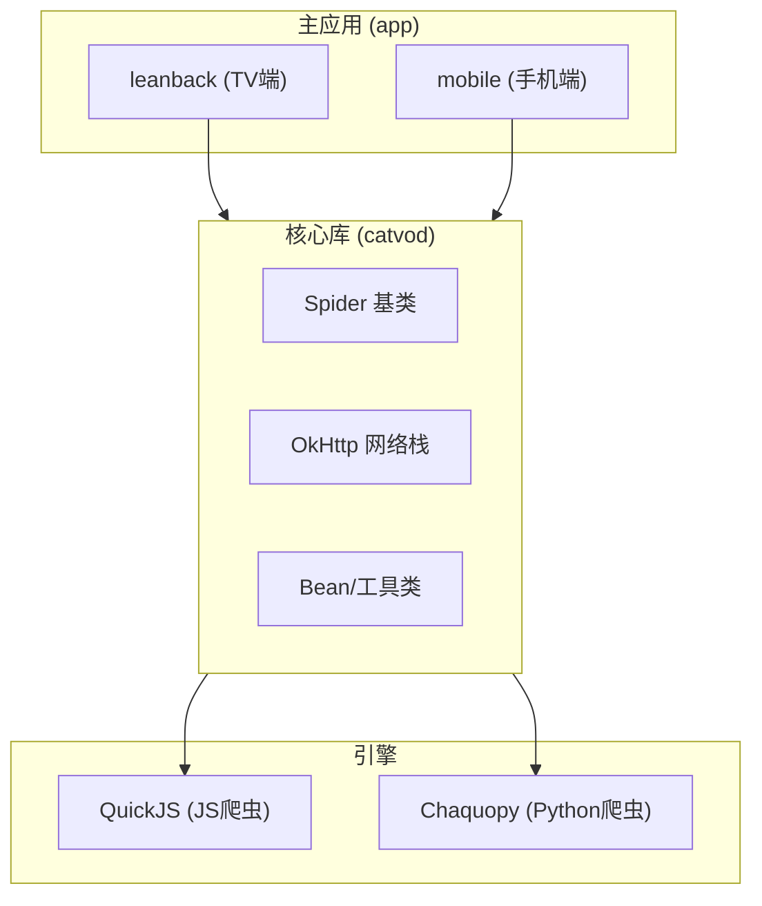

### 产品风味

| 风味 | 启动器 | 额外特性 |
|------|--------|---------|
| `leanback` | TV (`LEANBACK_LAUNCHER`) | 方向键导航、开机自启、DLNA DMR、TV banner |
| `mobile` | 手机 (`LAUNCHER`) | 扫码、生物识别、画中画、DLNA DMC |

---

## 一、首页 (HomeActivity)

### 1.1 TV端 (leanback/HomeActivity.java)

**入口方式**：
- 启动器：`LEANBACK_LAUNCHER`
- 方向键导航

**布局结构**：

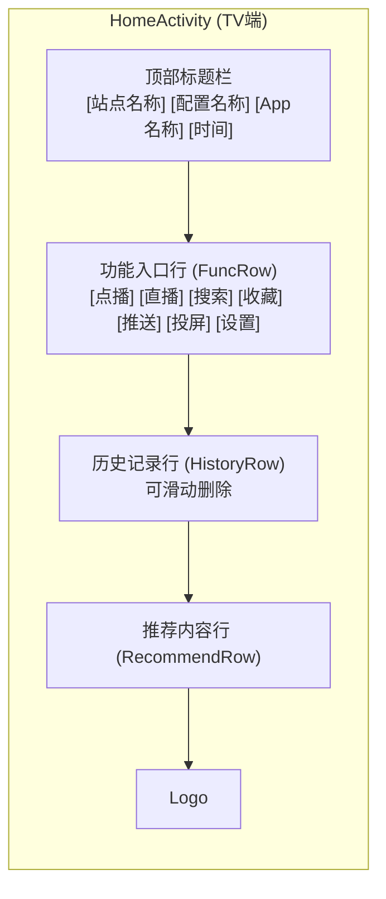

**核心功能**：

| 功能 | 说明 |
|------|------|
| 配置加载 | 加载点播/直播/壁纸配置 |
| 功能导航 | 功能快捷入口 |
| 历史管理 | 历史记录显示与删除 |
| 内容推荐 | 推荐内容展示 |
| 时钟显示 | 实时时间 |

**关键代码位置**：
- `app/src/leanback/java/com/fongmi/android/tv/ui/activity/HomeActivity.java:81`

### 1.2 手机端 (mobile/HomeActivity.java)

**入口方式**：
- 启动器：`LAUNCHER`
- 底部导航栏 (Material Design)

**布局结构**：

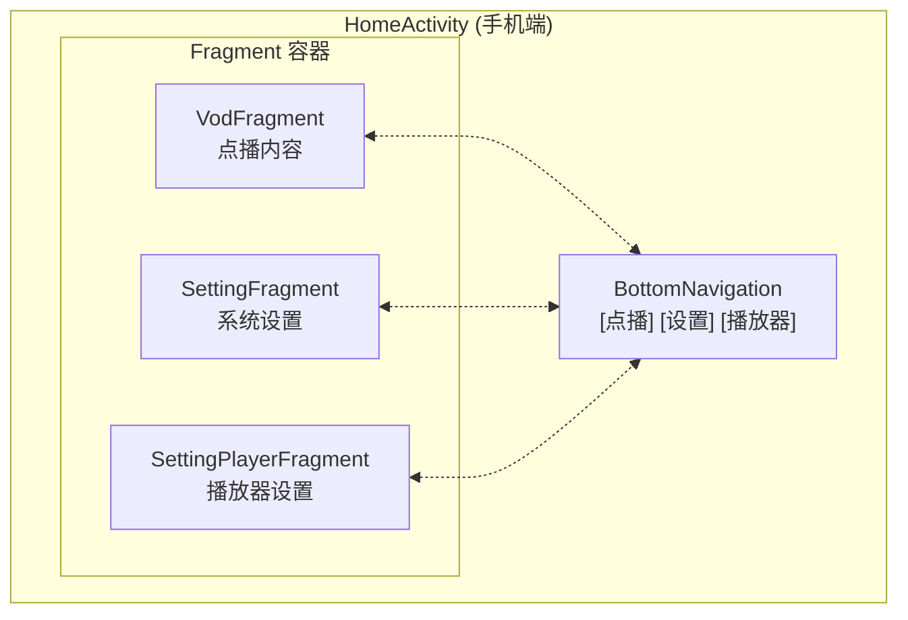

**关键代码位置**：
- `app/src/mobile/java/com/fongmi/android/tv/ui/activity/HomeActivity.java:53`

---

## 二、点播模块 (Vod)

### 2.1 页面结构

**TV端**：`VodActivity`
**手机端**：`VodFragment`

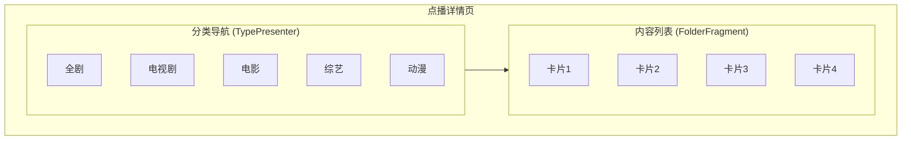

### 2.2 功能列表

| 功能 | 说明 |
|------|------|
| 分类切换 | 不同站点分类显示 |
| 筛选器 | 支持多维度筛选 |
| 站点切换 | 切换不同视频源 |
| 链接输入 | 支持手动输入播放链接 |
| 详情查看 | 查看历史记录 |

### 2.3 关键文件

| 文件 | 风味 | 位置 |
|------|------|------|
| VodActivity | leanback | `app/src/leanback/java/.../ui/activity/VodActivity.java` |
| VodFragment | mobile | `app/src/mobile/java/.../ui/fragment/VodFragment.java` |
| FolderFragment | 共享 | `app/src/*/java/.../ui/fragment/FolderFragment.java` |

---

## 三、搜索模块 (Search)

### 3.1 搜索页面结构

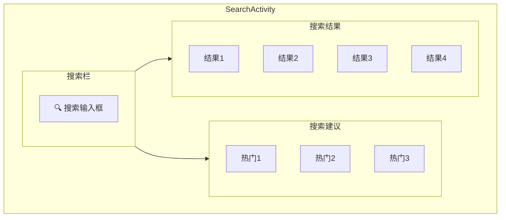

### 3.2 功能特性

| 功能 | 说明 |
|------|------|
| 多站点搜索 | 并行搜索 (20线程) |
| 搜索建议 | 热门关键词提示 |
| 搜索历史 | 记录历史搜索 |
| 实时搜索 | 输入即搜索 |

**关键文件**：
- `app/src/mobile/java/.../ui/activity/SearchActivity.java`
- `app/src/mobile/java/.../ui/fragment/SearchFragment.java`

---

## 四、收藏模块 (KeepActivity)

### 4.1 页面布局

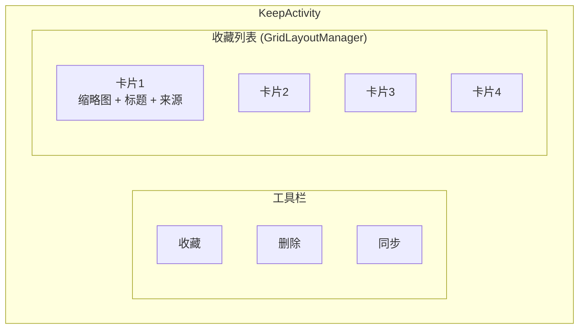

### 4.2 功能列表

| 功能 | 说明 |
|------|------|
| 收藏展示 | 网格布局显示 |
| 批量删除 | 长按进入删除模式 |
| 云端同步 | 支持远程同步 |
| 快速播放 | 点击直接播放 |

**关键文件**：
- `app/src/mobile/java/.../ui/activity/KeepActivity.java`

---

## 五、历史记录模块 (HistoryActivity)

### 5.1 页面布局

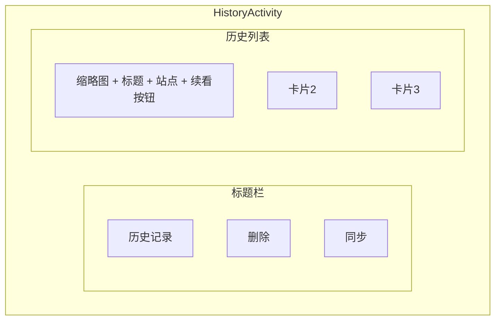

### 5.2 功能列表

| 功能 | 说明 |
|------|------|
| 历史展示 | 播放历史记录 |
| 断点续播 | 从上次位置继续 |
| 批量删除 | 长按进入删除模式 |

**关键文件**：
- `app/src/mobile/java/.../ui/activity/HistoryActivity.java`

---

## 六、直播模块 (LiveActivity)

### 6.1 TV端直播布局

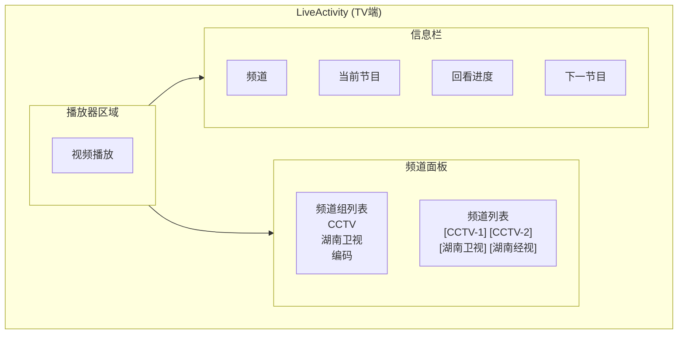

### 6.2 控制栏布局

```
┌─────────────────────────────────────────────────────────────────┐
│  [播放] [快退] [快进] [上一台] [下一台] [速度]                   │
│  [比例] [解码] [线路] [声道] [字幕] [片头] [片尾]               │
│  [反序] [循环] [自动换台]                                       │
└─────────────────────────────────────────────────────────────────┘
```

### 6.3 功能特性

| 功能 | 说明 |
|------|------|
| 频道选择 | 按组分类的频道列表 |
| EPG节目指南 | 当前/预告节目信息 |
| 时移/回看 | 支持catchup的频道时移 |
| 线路切换 | 多线路自动切换 |
| 快捷键换台 | 数字键快速选台 |
| 收藏频道 | 长按收藏/取消收藏 |

**关键文件**：
- `app/src/leanback/java/.../ui/activity/LiveActivity.java:78`

---

## 七、播放模块 (VideoActivity)

### 7.1 播放器布局

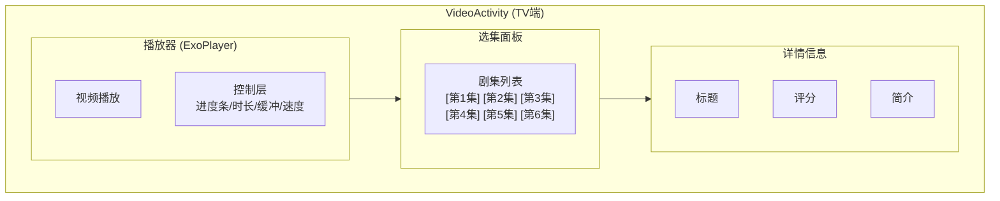

### 7.2 功能列表

| 功能 | 说明 |
|------|------|
| 选集切换 | 多集快速选择 |
| 解析器 | 多种解析方案 |
| 弹幕 | DanmakuFlameMaster |
| 字幕 | 外挂字幕支持 |
| 音轨 | 多音轨切换 |
| 速度调节 | 0.25x - 2x |
| 投屏 | DLNA投射 |

**关键文件**：
- `app/src/leanback/java/.../ui/activity/VideoActivity.java:105`
- `app/src/mobile/java/.../ui/activity/VideoActivity.java`

---

## 八、设置模块

### 8.1 设置页面

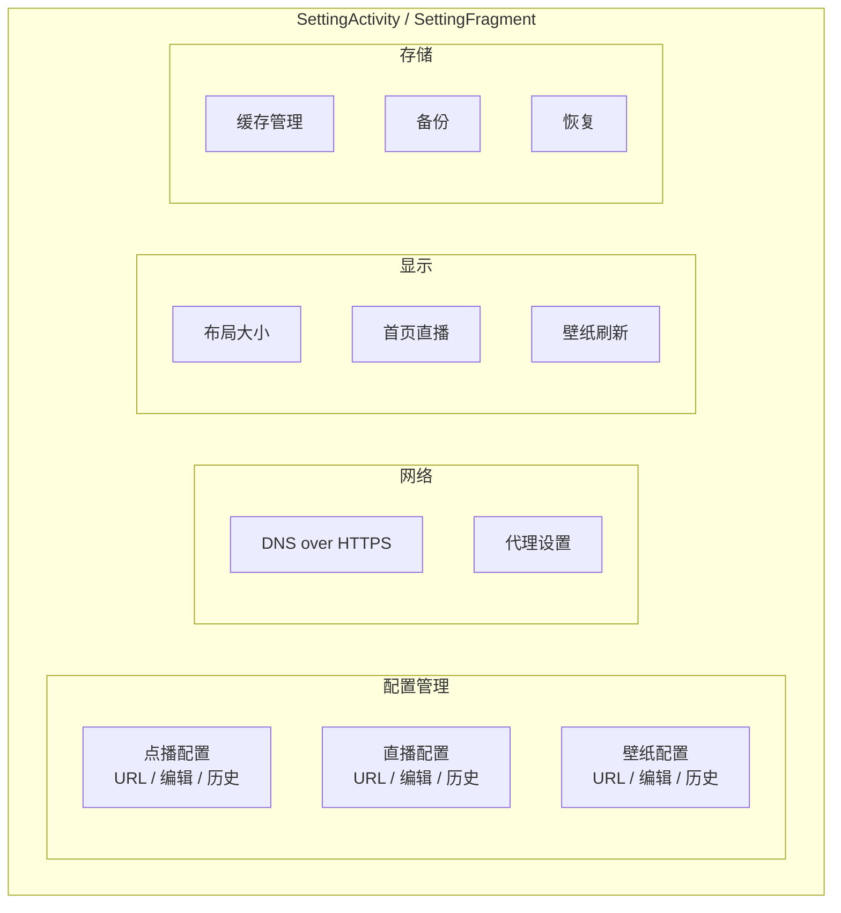

### 8.2 功能列表

| 功能 | 说明 |
|------|------|
| 配置管理 | 点播/直播/壁纸配置切换与编辑 |
| DNS | DoH (DNS over HTTPS) 配置 |
| 备份恢复 | 数据库备份与恢复 |
| 缓存管理 | 缓存查看与清理 |

**关键文件**：

| 文件 | 风味 | 位置 |
|------|------|------|
| SettingActivity | leanback | `app/src/leanback/java/.../activity/SettingActivity.java` |
| SettingFragment | mobile | `app/src/mobile/java/.../fragment/SettingFragment.java` |

---

## 九、播放器设置 (SettingPlayerActivity)

### 9.1 设置项

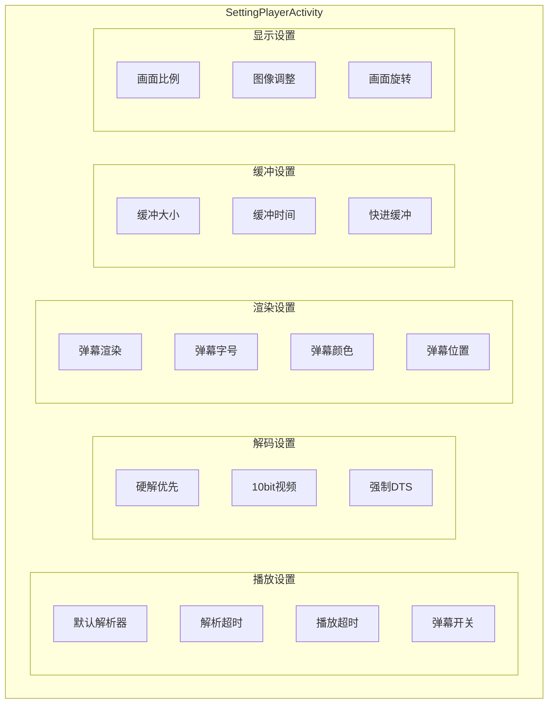

### 9.2 设置项详解

#### 播放设置

| 设置项 | 选项 | 说明 |
|--------|------|------|
| 默认解析器 | 自动/接口1/接口2... | 解析方案选择 |
| 解析超时 | 10s/15s/20s/30s | URL解析超时 |
| 播放超时 | 10s/15s/20s/30s | 播放启动超时 |
| 弹幕 | 开启/关闭 | 弹幕显示开关 |

#### 解码设置

| 设置项 | 选项 | 说明 |
|--------|------|------|
| 硬解优先 | 是/否 | 优先硬件解码 |
| 10bit视频 | 是/否 | 支持10bit视频 |
| 强制DTS | 是/否 | 强制DTS解码 |

#### 渲染设置

| 设置项 | 选项 | 说明 |
|--------|------|------|
| 弹幕渲染 | GPU/Cookie | 渲染引擎 |
| 弹幕字号 | 大/中/小 | 字体大小 |
| 弹幕颜色 | 彩色/白色 | 弹幕颜色 |
| 弹幕位置 | 上半/下半/全屏 | 显示位置 |

#### 缓冲设置

| 设置项 | 选项 | 说明 |
|--------|------|------|
| 缓冲大小 | 4MB/8MB/16MB/32MB | 缓冲区块大小 |
| 缓冲时间 | 3s/5s/10s/30s | 缓冲时长 |
| 快进缓冲 | 开启/关闭 | 快进时缓冲 |

**关键文件**：
- `app/src/leanback/java/.../activity/SettingPlayerActivity.java`
- `app/src/mobile/java/.../fragment/SettingPlayerFragment.java`

---

## 十、特色功能

### 10.1 功能模块总览

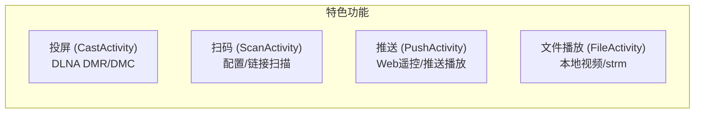

### 10.2 投屏功能

| 功能 | 说明 |
|------|------|
| CastActivity | TV端 DLNA DMR (渲染端) |
| DMC支持 | 手机端 DLNA DMC (控制端) |

### 10.3 扫码功能

- 扫描配置二维码
- 扫描播放链接

### 10.4 推送功能

- Web 遥控器
- 网页推送播放

### 10.5 文件播放

- 本地视频文件播放
- 支持 strm 播放列表

---

## 十一、数据流向

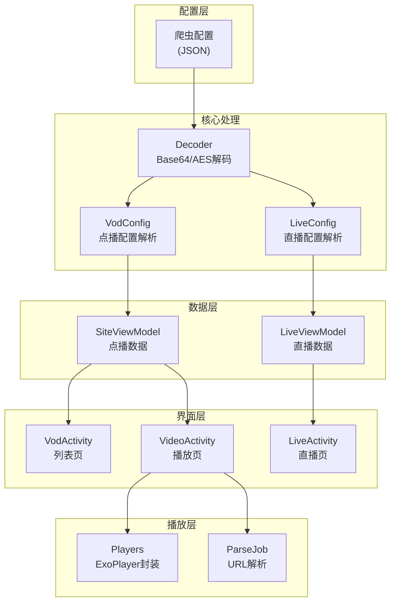

---

## 十二、站点类型与解析类型

### 12.1 站点类型码

| 类型码 | 含义 | 说明 |
|--------|------|------|
| `0` | XML API | 旧版接口，XML响应 |
| `1` | JSON API v1 | JSON格式接口 |
| `3` | JAR爬虫 | API以`csp_`为前缀 |
| `4` | JS爬虫 | API以`.js`结尾 |

### 12.2 解析类型码

| 类型码 | 含义 | 说明 |
|--------|------|------|
| `0` | WebView嗅探 | 正则拦截媒体URL |
| `1` | JSON API | HTTP请求解析 |
| `2` | JSON扩展 | JAR扩展并行调用 |
| `3` | JSON混合 | flag感知多解析器 |
| `4` | 万能解析 | 所有type-1 + WebView |

---

## 十三、线程池配置

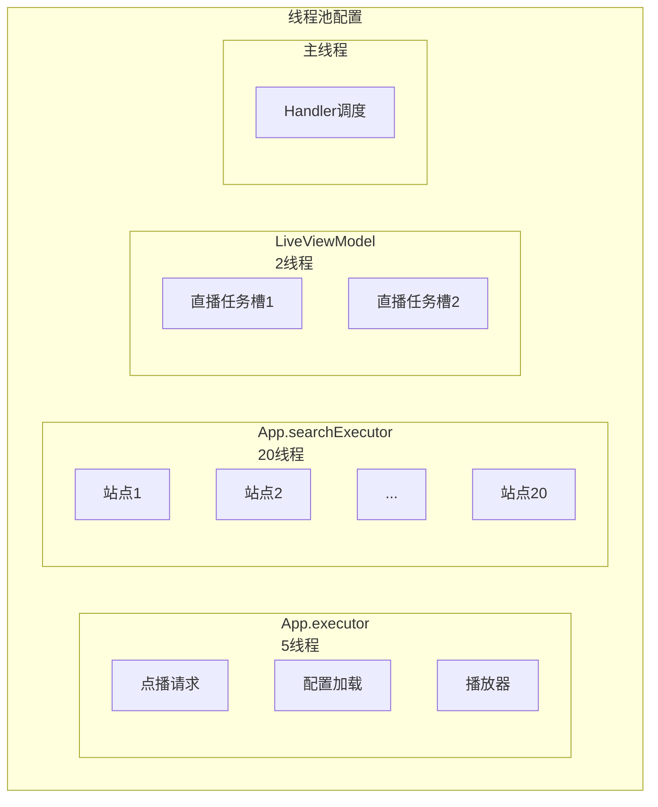

### 线程池参数

| 线程池 | 大小 | 用途 |
|--------|------|------|
| `App.executor` | 5 | 通用：点播、配置、播放器 |
| `App.searchExecutor` | 20 | 多站点并行搜索 |
| `LiveViewModel` | 2 | 直播任务（4个类型槽） |
| 主线程 | - | `App.post(r, delay)` 调度 |

### 超时配置

| 类型 | 超时 |
|------|------|
| 播放超时 | 15秒 |
| URL解析超时 | 15秒 |

---

## 十四、关键类速查

| 类名 | 位置 | 职责 |
|------|------|------|
| `App` | `main/.../App.java` | Application单例，Gson、线程池、Handler |
| `VodConfig` | `main/.../api/config/VodConfig.java` | 点播配置解析，管理站点和解析器 |
| `LiveConfig` | `main/.../api/config/LiveConfig.java` | 直播配置解析，管理频道 |
| `Decoder` | `main/.../api/Decoder.java` | 配置URL解码：Base64/AES-CBC |
| `BaseLoader` | `main/.../api/loader/BaseLoader.java` | 爬虫初始化路由 |
| `Spider` | `catvod/.../crawler/Spider.java` | 爬虫抽象基类 |
| `SiteViewModel` | `main/.../model/SiteViewModel.java` | 点播数据：首页、分类、详情、播放、搜索 |
| `LiveViewModel` | `main/.../model/LiveViewModel.java` | 直播数据：频道列表、EPG、流地址 |
| `Players` | `main/.../player/Players.java` | ExoPlayer封装，DRM、轨道、弹幕、重试 |
| `Source` | `main/.../player/Source.java` | URL路由到Extractor |
| `ParseJob` | `main/.../player/ParseJob.java` | URL解析任务，支持5种类型 |
| `Server` | `main/.../server/Server.java` | NanoHTTPD本地HTTP API |
| `AppDatabase` | `main/.../db/AppDatabase.java` | Room数据库（版本35） |
| `Setting` | `main/.../Setting.java` | SharedPreferences访问器 |

---

## 十五、EventBus事件类型

| 事件类 | 类型 | 说明 |
|--------|------|------|
| `ConfigEvent` | VOD/COMMON/BOOT | 配置变更事件 |
| `PlayerEvent` | PREPARE/PLAYING/BUFFERING/READY/ENDED/TRACK/SIZE | 播放器状态 |
| `ErrorEvent` | - | 错误通知 |
| `ActionEvent` | PLAY/PAUSE/NEXT/PREV/STOP | 远程控制动作 |
| `RefreshEvent` | HOME/HISTORY/SIZE/CATEGORY/KEEP/LIVE/PLAYER | 刷新事件 |
| `CastEvent` | - | 投屏事件 |
| `ServerEvent` | SEARCH/PUSH | 服务器事件 |
| `StateEvent` | EMPTY/PROGRESS | 状态事件 |

---

## 十六、网络栈特性 (catvod模块)

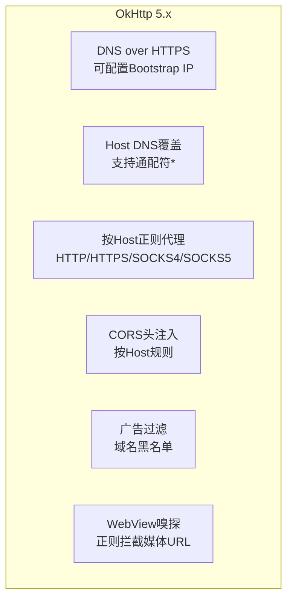

### 特性说明

| 特性 | 说明 |
|------|------|
| DNS over HTTPS | 支持自定义DoH服务器 |
| Host覆盖 | 支持通配符`*`匹配 |
| 代理规则 | 按Host正则配置代理 |
| CORS注入 | 按Host规则注入跨域头 |
| 广告过滤 | 配置`ads`字段域名黑名单 |
| WebView嗅探 | UA伪装，正则拦截 |

---

## 十七、本地HTTP API

`Server` (NanoHTTPD) 在 9978-9998 端口中选取第一个可用端口启动。

### 接口路径

| 路径 | 说明 |
|------|------|
| `/action` | 动作控制 |
| `/cache` | 缓存管理 |
| `/media` | 媒体信息 |
| `/file` | 文件操作 |
| `/parse` | 解析接口 |
| `/proxy` | 代理服务 |
| `/device` | 设备信息 |
| `/tvbus` | TVBus协议 |

详细文档见 `/docs/LOCAL.md`

---

## 十八、数据库

### 18.1 基本信息

| 项目 | 值 |
|------|------|
| 数据库名 | `tv` |
| 当前版本 | 35 |
| 迁移文件 | `Migrations.java` |

### 18.2 实体表

| 实体 | 说明 |
|------|------|
| `Keep` | 收藏记录 |
| `Site` | 站点配置 |
| `Live` | 直播配置 |
| `Track` | 播放轨道 |
| `Config` | 配置记录 |
| `Device` | 设备信息 |
| `History` | 播放历史 |

### 18.3 存储策略

| 项目 | 策略 |
|------|------|
| 历史TTL | 60天 |
| 备份格式 | gzip `.bk.gz` |
| 备份保留 | 最近7份 |

---

## 十九、配置加密格式

`Decoder` 支持三种配置格式：

| 格式 | 特征 | 说明 |
|------|------|------|
| 明文JSON | 直接使用 | 无前缀 |
| Base64 | 8位字母数字前缀 + `**` | 标准Base64 |
| AES-CBC | `2423`开头 | 密钥从内容派生 |

---

## 附录

### 文件路径约定

```
app/src/main/          共享代码
app/src/leanback/     TV端UI
app/src/mobile/       手机端UI
```

### 参考文档

| 文档 | 位置 | 说明 |
|------|------|------|
| CONFIG.md | `docs/` | 配置JSON字段说明 |
| SPIDER.md | `docs/` | Spider API规范 |
| LOCAL.md | `docs/` | 本地HTTP API说明 |
| LIVE.md | `docs/` | 直播源格式说明 |
